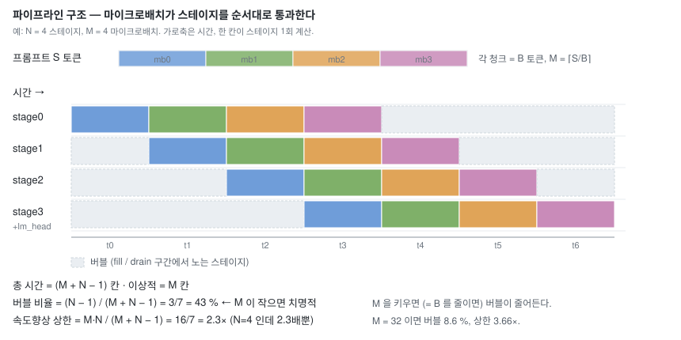
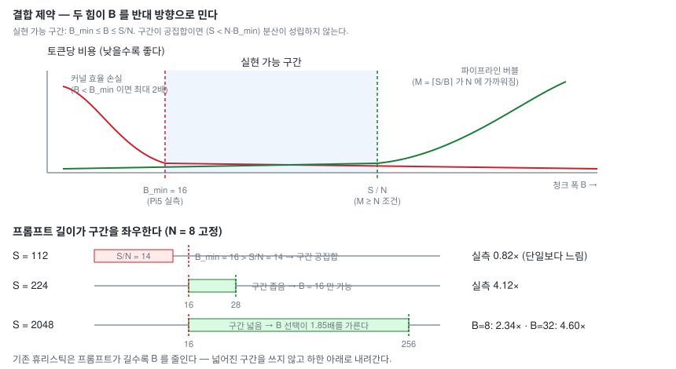
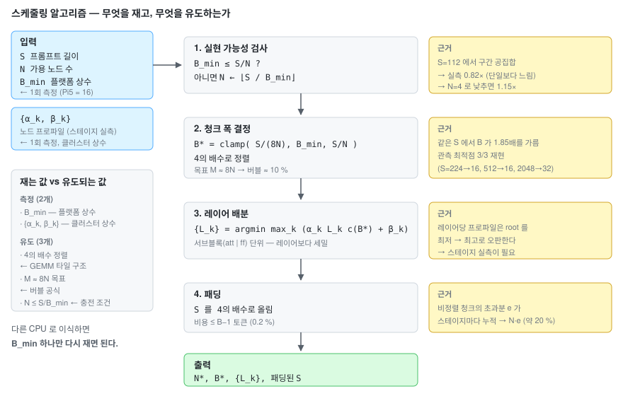

# 랩미팅 자료 — SBC CPU 클러스터의 Prefill 스케줄링

**주제**: Raspberry Pi 5 클러스터에서 LLM prefill(TTFT)을 어떻게 가속했는가
**대상 모델**: Llama-3 8B Q4_0 / **클러스터**: Pi5 ×8 (16 GB ×4, 8 GB ×4), 1 GbE
**선행 연구**: PiPP (decode 단계 stage-skip) — 이 연구는 **prefill 단계**를 다룬다
**작성 시점**: 2026-08-13

---

## 0. 한 장 요약

S=447 토큰, Llama-3 8B Q4_0 기준.

| | prefill | 노드를 늘리면 |
|---|---|---|
| 기존 distributed-llama 단일 노드 | 221.7 s | — |
| 기존 distributed-llama 분산 (최고) | 33.6 s | **나빠진다** (2→4노드: 0.87→0.80×) |
| llama.cpp 단일 노드 (외부 기준선) | 27.7 s | — |
| **본 연구 단일 노드** | **29.5 s** | — |
| **본 연구 PP8** | **5.3 s** | **좋아진다** (1.53 → 2.52 → 5.59×) |

**핵심은 절대 수치보다 스케일링 곡선의 부호가 바뀌었다는 것이다.**
기존 구현은 노드를 늘릴수록 느려졌고, 현재는 단조적으로 빨라진다.
분산으로 얻은 배수 **5.6×**, llama.cpp 단일 대비 **5.3×**.

핵심 주장 세 가지:

1. **CPU 클러스터에서는 청크 폭 `B` 가 스케줄링의 자유변수다.** GPU 에는 없는 자유도이고,
   잘못 고르면 같은 하드웨어에서 **1.85배**를 잃는다.
2. **프롬프트 길이 `S` 가 유효 노드 수의 상한을 정한다** (`N ≤ S/B_min`).
   이 제약을 위반하면 노드를 늘릴수록 **느려진다** (실측 0.82×).
3. 필요한 측정은 **`B_min` 단 하나**(플랫폼 상수) + 클러스터 프로파일 1회.
   다른 CPU 로 옮길 때 재측정할 값이 하나뿐이다.

---

## 1. 문제 정의 — 왜 prefill 인가

decode 는 **메모리 대역폭 바운드**다. 토큰 1개마다 가중치 전체를 읽는다.
prefill 은 **연산 바운드**다. 프롬프트 전체를 한 번에 GEMM 으로 민다.

SBC 클러스터에서 이 차이가 중요한 이유:

| | decode | prefill |
|---|---|---|
| 병목 | 메모리 대역폭 (Pi5: ~17 GB/s) | 연산 (Pi5: 307 GOPS 이론 피크) |
| 노드 추가 효과 | 대역폭이 `N` 배 — 선형에 가까움 | 파이프라인 버블에 지배됨 |
| 선행 연구 | 많음 (PiPP 포함) | **거의 없음** |

그리고 실용적으로, S=2048 프롬프트의 TTFT 가 **143초**면 쓸 수 없다.
decode 를 아무리 빠르게 해도 첫 토큰이 2분 뒤에 나온다.

---

## 2. 출발점 — 기존 구현은 무엇을 하고 있었나

접근 방법을 정하기 전에, **기존 distributed-llama 가 실제로 어떤 성능을 내는지**를
같은 조건에서 재는 것부터 했다. 결과가 이 연구의 방향을 결정했다.

### 2.1 측정 조건

| 항목 | 값 |
|---|---|
| 모델 | Llama-3 8B Q4_0 (`dllama_model_llama3-8b_q40.m`) |
| 프롬프트 | **S = 447 토큰** (고정, 동일 파일) |
| 스레드 | 노드당 4 (Cortex-A76 4코어 전부) |
| 통신 | 1 GbE, **공인 IP(165.x) 직결** — 오버레이 VPN 미사용 |
| 버퍼 타입 | `q80` |
| 측정값 | `prefillMs` (프롬프트 처리 구간만. 디코드 제외) |
| 반복 | 워밍업 1회 **버림**, 이후 3라운드 **중앙값** |
| 외부 기준선 | llama.cpp build 6ea215d, 같은 노드/모델/스레드 → pp512 **16.15 ± 0.14 tok/s** |

워밍업을 버리는 이유: 5회 측정에서 첫 실행만 일관된 이상치였다
(49,992 / 34,077 / 34,824 / 34,418 / 32,414 ms). 시작 온도는 rep1 이 오히려
평범했으므로 열이 아니라 **콜드 스타트**다. rep1 을 버리면 편차가 51 % → 7 % 로 떨어진다.

### 2.2 단일 노드 — 외부 기준선의 12 %

| | prefill (S=447) | tok/s | llama.cpp 대비 |
|---|---|---|---|
| **기존 distributed-llama** | **221,712 ms** (496 ms/tok) | **2.01** | **12 %** |
| llama.cpp (외부 기준선) | 27,700 ms | 16.15 | 100 % |

**같은 하드웨어, 같은 모델, 같은 스레드 수인데 8배 느리다.**
이 상태에서 분산 결과를 논하는 것은 의미가 없다고 판단했고,
먼저 단일 노드를 정상화했다(→ §5.2).

### 2.3 노드를 늘려도 빨라지지 않았다 — 핵심 관찰

단일 노드를 32,417 ms 까지 정상화한 뒤(그 자체로 6.9×), **같은 코드의 분산 경로**를
축과 노드 수를 바꿔가며 쟀다. S=447, 같은 세션 교차 측정.

| 구성 | prefill | 단일 대비 | 노드 수 |
|---|---|---|---|
| **단일 노드** | **37,939 ms** | **1.00×** | 1 |
| TP 2노드 (초기) | 58,280 | **0.65×** | 2 |
| PP 4노드 + wave (초기) | 41,026 | **0.92×** | 4 |
| TP 2노드 (소켓 sleep 수정 후) | 33,633 | 1.13× | 2 |
| PP 4노드 + wave (수정 후) | 39,825 | **0.95×** | 4 |
| SP 2노드 | 43,620 | **0.87×** | 2 |
| SP 4노드 | 47,374 | **0.80×** | 4 |

읽는 법 두 가지:

- **어떤 구성도 단일 노드를 의미 있게 넘지 못한다.** 최고가 TP2 의 1.13× 이고,
  그마저 소켓 재시도의 1 ms 고정 sleep 을 `poll()` 로 바꾼 뒤에야 나왔다.
- **노드를 2 → 4 로 늘리면 오히려 나빠진다.** SP 는 0.87× → 0.80×,
  PP 는 4노드에서 0.95× 로 단일보다 느리다. **스케일링 곡선이 음의 기울기다.**

여기에 8노드 실험은 애초에 시도할 근거가 없었다 — 4노드가 2노드보다 나쁜데
8노드를 잴 이유가 없다.

### 2.4 왜 그랬는가 — 원인은 알고리즘이 아니라 구현이었다

이 지점에서 "PP 는 원래 SBC 에서 이득이 없다"고 결론 낼 수도 있었다. 그렇게 하지
않고 축별로 파고든 결과, **분산 경로 자체가 정상 동작하지 않고 있었다**는 것이 드러났다.

| 축 | 실제 상태 |
|---|---|
| **PP** | 동작하지만 **마이크로배치 겹침이 꺼져 있었다**(`--wave-pipeline` 기본 off) → 사실상 직렬 실행 |
| **TP** | **깨짐** — perplexity 편차 **653,245 %**. 배치 sync 를 꺼도 동일 → **사전 결함** |
| **SP** | **깨짐** — 애초에 토큰 축 병렬이 아니라 P/D 분리용 축. 모든 노드가 같은 토큰을 계산한다 |

그리고 결정적인 것:

> **`--workers` 를 주면 자동으로 PP 가 된다. TP 는 실행된 적이 없었다.**
> `app.cpp` 의 `Auto PP heuristic` 이 `ppSize = nNodes` 로 덮어쓰고 있었다.
> "TP4"(73,907 ms)와 "PP4"(73,374 ms)가 같은 시간이었던 이유다 — 통신량은 21배
> 차이인데. **끄고 켠 것이 애초에 같은 것이었다.**

즉 §2.3 의 표는 "분산 알고리즘의 한계"를 잰 것이 아니라
**직렬 PP 를 여러 이름으로 잰 것**이었다.

- PP 는 스테이지를 겹치지 않으므로 노드를 늘려도 총 연산 시간이 그대로다.
  통신과 배리어만 추가되니 **N 이 커질수록 느려지는 것이 당연하다.**
- SP 는 `gemm` 시간이 단일 노드와 동일했다(36.5 / 32.8 초 vs 33.1 초).
  **연산이 전혀 나뉘지 않았다**는 직접 증거다.

### 2.5 현재 성능 — 어디까지 왔나

같은 프롬프트(S=447), 같은 측정 절차. 게이트 전부 통과(편차 0.7 % 이내).

| | prefill | 단일 대비 | 기존 원본 대비 |
|---|---|---|---|
| 기존 distributed-llama 단일 | 221,712 ms | — | 1.00× |
| 기존 distributed-llama 최고 분산 (TP2) | 33,633 ms | — | 6.6× |
| 본 연구 단일 노드 | 29,454 ms | 1.00× | 7.5× |
| 본 연구 PP2 | 19,245 ms | 1.53× | 11.5× |
| 본 연구 PP4 | 11,709 ms | 2.52× | 18.9× |
| **본 연구 PP8** | **5,273 ms** | **5.59×** | **42.0×** |

**스케일링 곡선의 부호가 바뀌었다.** 기존 구현은 노드를 늘리면 나빠졌고
(1.00 → 0.95 → 시도 안 함), 현재는 단조 증가한다 (1.00 → 1.53 → 2.52 → 5.59×).

긴 프롬프트에서도 확인된다:

| S (실제 토큰) | 단일 | PP8 | 배수 |
|---|---|---|---|
| 447 | 29,454 ms | **5,305 ms** | **5.55×** |
| 1,789 | 142,867 ms | **27,218 ms** | 5.25× |
| **7,212** | **1,031,979 ms** | **161,283 ms** | **6.40×** |

**프롬프트가 길수록 배수가 커진다** — 모델이 예측한 방향 그대로다
(`M`이 커져 버블 `(N−1)/(M+N−1)`이 줄어든다). S=7,212 에서 `M=226` 이므로
모델 상한은 7.76× 이고, 실측 6.40× 는 그 **82 %** 다 — 지금까지 중 가장 높은 달성률이다.
단일 노드로는 **17분**이 걸리는 프롬프트를 **2.7분**으로 줄인다.

> S=7,212 는 **직전까지 완주 자체가 불가능했다** — 파이프라인 데드락으로 죽었다(§5.7).
> 이 세션에서 원인을 잡아 처음으로 끝까지 돌았다.

### 2.6 이 관찰이 연구 방향을 정했다

세 가지가 따라 나왔다.

1. **단일 노드 정상화가 선결 조건이다.** 기준선이 외부 대비 12 % 인 상태에서는
   분산 이득을 측정할 수 없다. → §5.2
2. **동작하는 축은 PP 하나뿐이다.** TP/SP 를 고치는 것보다 PP 를 제대로 굴리는 쪽이
   빠르고, 통신량 분석(21 vs 448 MB)도 같은 결론을 가리켰다. → §3.1
3. **"분산이 느리다"는 결론은 측정 대상이 틀려서 나온 것이었다.**
   이후 모든 성능 측정 앞에 **정확성 게이트**를 두기로 했다. → §5.1

---

## 3. 설계 — 어떻게 접근했는가

### 3.1 네 가지 병렬화 축 — 무엇을 어떻게 자르는가

Transformer 는 `[레이어] × [토큰] × [은닉 차원]` 의 3차원 계산이다.
병렬화 축은 **이 셋 중 무엇을 자르는가**로 갈린다.

| 축 | 무엇을 자르나 | 각 노드가 갖는 것 | 노드 간 통신 시점 |
|---|---|---|---|
| **PP** (Pipeline) | **레이어 축** | 레이어 `L/N` 개의 **가중치 전부** | 스테이지 경계에서 **1회**, 은닉 벡터 `B×d` |
| **TP** (Tensor) | **은닉 차원 축** | 모든 레이어의 가중치 **일부 열/행** | **레이어마다 2회** all-reduce (attn 출력, FFN 출력) |
| **CP** (Context / 토큰 축) | **토큰 축** | 가중치 **전부**, 토큰 `S/N` 개 | attention 마다 KV 를 **링으로 순회** |
| **SP** (Sequence) | 토큰 축 (KV **저장**만) | 가중치 전부, KV 캐시 `S/N` | KV 접근 시 |

그림으로 보면:

```
        레이어 0 ───────────── 레이어 31
토큰 0  ┌──────────────────────────────┐
  │     │                              │
토큰 S  └──────────────────────────────┘

PP:  │  n0  │  n1  │  n2  │  n3  │      ← 세로로 자른다 (레이어)
TP:  ═══════════════════════════════    ← 각 레이어를 은닉 차원으로 자른다(그림 밖 축)
CP:  ┌──── n0 ────┐                     ← 가로로 자른다 (토큰)
     ├──── n1 ────┤
```

- **PP**: 노드 0 이 레이어 0~3 을, 노드 1 이 4~7 을 맡는다. 토큰 묶음(마이크로배치)이
  노드를 **순서대로 통과**한다. 컨베이어 벨트다.
- **TP**: 모든 노드가 모든 레이어를 함께 계산하되, 행렬을 열 방향으로 쪼개 나눠 곱하고
  **매번 합친다**(all-reduce). 노드가 한 몸처럼 움직인다.
- **CP**: 노드마다 다른 토큰 구간을 맡는다. 하지만 attention 은 모든 토큰이 모든
  이전 토큰을 봐야 하므로, KV 를 노드 간에 **돌려가며(ring)** 주고받아야 한다.
- **SP**: 계산은 안 나누고 KV 캐시 **저장만** 나눈다. 메모리 최적화이지 병렬화가 아니다.
  (이 코드베이스에서는 P/D 분리용 축이었고, 실제로 `gemm` 시간이 단일 노드와 같았다.)

#### 통신량 실측 (S=448, 8B 모델)

| 축 | 통신량 | 1 GbE(118 MB/s)에서 | 판정 |
|---|---|---|---|
| **PP** | **21 MB** | **0.18 s** | **채택** |
| TP | 448 MB | **3.8 s** | 기각 |
| CP (Ring) | 168 MB | 1.4 s | 보류 |
| SP | — | — | 사용 불가 (병렬화 아님) |

### 3.2 왜 CPU 클러스터에서 PP 인가 — 아키텍처 관점

통신량만으로도 결론은 나오지만, **왜 그런 차이가 나는지**는 하드웨어 구조에서 온다.
네 가지 이유가 있고, 넷 다 GPU 에서는 반대로 작동한다.

#### (1) 복사 엔진이 없다 — 통신이 곧 연산 시간이다

GPU 는 **DMA 복사 엔진**이 SM 과 독립적으로 돈다. 커널이 계산하는 동안
별도 하드웨어가 PCIe/NVLink 로 데이터를 옮긴다. **통신이 연산을 뺏지 않는다.**

CPU 노드에는 그런 것이 없다. 소켓으로 보내려면
`memcpy` → 커널 버퍼 복사 → NIC DMA 개시를 **CPU 코어가 직접** 한다.
Pi5 는 코어가 **4개뿐**이라, 통신 스레드 하나가 도는 동안 연산 처리량의 25 % 가 사라진다.

> **CPU 클러스터에서는 "바이트를 옮긴다"가 곧 "FLOPs 를 잃는다"이다.**
> 그래서 총 통신량(21 vs 448 MB)이 지연시간보다 직접적으로 중요하다.

#### (2) 동기화가 코어 전체를 멈춘다

TP 는 레이어마다 all-reduce 가 필요하고, 그것은 **모든 노드가 만나는 배리어**다.
32레이어 × 2회 × 마이크로배치 `M`개 = S=448 에서 **896회**.

GPU 는 배리어 동안에도 다른 스트림/워프가 SM 을 채운다. 스케줄러가 수천 개
워프를 갖고 있으니 몇 개가 대기해도 처리량이 유지된다.
CPU 는 **코어 4개가 전부**다. 배리어에서 막히면 노드 전체가 논다.

실측이 이를 그대로 보여줬다:

```
TP 2노드, S=447:  배리어 896회에 syncWait 39.3초 = 배리어당 43.9 ms
                  그중 실제 회선 시간은 6.9 ms 뿐
```

PP 는 다르다. 스테이지 경계의 통신이 **점대점(point-to-point)** 이고,
받는 노드는 그 사이 **다른 마이크로배치를 계산하고 있다.**
동기화가 전역 배리어가 아니라 국소 의존이다.

#### (3) 느린 연산이 오히려 PP 에 유리하다

역설적이지만 중요한 점이다. 통신을 숨길 수 있는지는 **절대 속도가 아니라 비율**로 정해진다.

| | 스테이지 연산 시간 | 경계 전송 (0.5 MB) | 비율 |
|---|---|---|---|
| Pi5 (208 GFLOPS) | ~150 ms | ~4 ms | **2.7 %** |
| A100 급 (~100× 빠름) | ~1.5 ms | ~4 ms (같은 1 GbE 가정) | **270 %** |

**CPU 노드가 느리기 때문에 스테이지 연산 시간이 길고, 그 그늘에 전송이 완전히 숨는다.**
같은 네트워크를 GPU 에 붙이면 전송이 연산보다 오래 걸려 파이프라인이 성립하지 않는다.
GPU 클러스터가 굳이 NVLink 를 까는 이유이고, **우리가 1 GbE 로 버틸 수 있는 이유다.**

#### (4) 메모리 계층 — PP 는 노드당 워킹셋을 `1/N` 로 줄인다

prefill 은 연산 바운드지만, 그 연산은 **가중치를 DRAM 에서 읽어와야** 시작된다.
Pi5 의 메모리 대역폭은 ~17 GB/s 로 데스크톱 CPU 의 1/5 수준이다.

- **PP**: 노드는 자기 레이어 `L/N` 개의 가중치만 만진다. 8노드면 4.5 GB → **560 MB**.
  마이크로배치마다 이 560 MB 를 **순차적으로** 훑는다 — 프리페처에 가장 유리한 패턴이고,
  8 GB 노드에서도 페이지 캐시에 여유 있게 상주한다.
- **TP**: 모든 노드가 **모든 레이어**를 만진다. 가중치는 열 방향으로 쪼개져 있어
  각 노드의 접근이 **스트라이드**가 된다. 총량은 같아도 캐시라인 활용률이 떨어진다.
- **CP**: 모든 노드가 가중치 **전부**(4.5 GB)를 갖는다. 8 GB 노드에서 빠듯하고,
  워킹셋 축소 효과가 아예 없다.

> **PP 만이 "노드를 늘리면 노드당 메모리 압력이 줄어든다"는 성질을 갖는다.**
> SBC 처럼 메모리 대역폭과 용량이 모두 빠듯한 환경에서 이 성질이 크다.

### 3.3 decode 와는 축 선택이 반대다 — PiPP 와의 관계

같은 클러스터, 같은 모델인데 **prefill 과 decode 는 유리한 축이 뒤집힌다.**
이것이 선행 연구(PiPP, decode 단계)와 이 연구가 다른 축을 택한 이유다.

| | decode | prefill |
|---|---|---|
| 한 번에 처리하는 토큰 | **1개** | **`B`개 (16~32)** |
| 레이어 경계 활성값 | `d` = 4096 float = **16 kB** | `B×d` = **0.5~2 MB** |
| TP 의 all-reduce | 16 kB → **지연 바운드** (작아서 견딜 만함) | 0.5 MB × 64회 → **대역폭 바운드** (치명적) |
| PP 의 파이프라인 충전 | 토큰이 1개뿐 → `M=1` → **`N-1` 스테이지가 논다** | `M = S/B` = 14~226 → **파이프라인이 찬다** |
| 병목 | 메모리 대역폭 (가중치 전체를 1토큰마다 읽음) | 연산 |
| 유리한 축 | **TP** 또는 stage-skip (PiPP) | **PP** |

읽는 법:

- **decode 에서 PP 는 원리적으로 무의미하다.** 토큰이 하나뿐이라 파이프라인에 넣을
  마이크로배치가 없다. `N`단 파이프라인에 1개를 흘리면 나머지 `N-1`단은 항상 논다.
  PiPP 가 stage-skip 이라는 다른 접근을 택한 이유다.
- **prefill 에서 TP 는 원리적으로 불리하다.** 활성값이 `B` 배로 커져 all-reduce 가
  지연 문제에서 **대역폭 문제**로 바뀐다. 1 GbE 에서 3.8초다.

> **prefill 은 "쪼갤 토큰이 많다"는 성질을 갖고, PP 는 정확히 그것을 필요로 한다.**
> 그리고 이 성질이 §3.6 의 결합 제약(`M ≥ N`)으로 곧장 이어진다 —
> 토큰이 충분하지 않으면 PP 는 성립하지 않는다.

### 3.4 축 선택 요약

| | PP | TP | CP | SP |
|---|---|---|---|---|
| 통신량 (S=448) | **21 MB** | 448 MB | 168 MB | — |
| 동기화 형태 | 점대점 | **전역 배리어 ×896** | 링 순회 | — |
| 노드당 가중치 | **`1/N`** | `1/N` (스트라이드) | 전부 | 전부 |
| 연산으로 통신 은닉 | **가능** (wave) | 불가 (임계경로) | 부분적 | — |
| prefill 적합성 | **채택** | 기각 | 보류 | 사용 불가 |

**저대역폭 인터커넥트 + 적은 코어 수 + 좁은 메모리 대역폭**이라는 SBC 의 세 제약이
모두 같은 방향(PP)을 가리킨다. GPU 클러스터에서는 셋 다 해당되지 않아 TP 가 기본이 된다.

### 3.5 파이프라인 구조



그림에서 읽을 것 두 가지:

- **fill / drain 구간(회색)이 버블이다.** 처음 `N−1` 칸은 뒤쪽 스테이지가 놀고,
  마지막 `N−1` 칸은 앞쪽 스테이지가 논다. 총 시간이 `M` 이 아니라 `M + N − 1` 칸이 된다.
- **버블은 `M` 이 작을수록 치명적이다.** 그림의 `M=4, N=4` 는 버블 43 %,
  4노드인데 상한이 2.3배뿐이다. `M=32` 면 버블 8.6 %, 상한 3.66배가 된다.

```
프롬프트 S 토큰
   │
   ├─ 청크 B 개씩 M = ⌈S/B⌉ 개의 마이크로배치로 분할
   │
   └─ 각 마이크로배치가 N 단 파이프라인을 통과
        stage0 (레이어 0..L0)  →  stage1  →  ...  →  stage(N-1) + lm_head

   버블 = (N-1) / (M + N - 1)          ← GPipe 와 동일한 형태
   속도향상 상한 = M·N / (M + N - 1)
```

여기서 **`B` 를 누가 정하는가**가 이 연구의 출발점이다.
기존 구현은 휴리스틱으로 정했고, 그 휴리스틱이 **긴 프롬프트에서 청크를 줄이고 있었다** —
정확히 반대 방향이다.

### 3.6 결합 제약 — 이 연구의 핵심 구조

`B` 에는 서로 반대 방향으로 작용하는 두 제약이 걸린다.



위 그림(곡선)은 두 힘을, 아래 그림(수직선)은 프롬프트 길이가 구간을 어떻게 바꾸는지를 보여준다.
**`S` 가 짧으면 구간이 사라지고, 길면 구간이 넓어져 `B` 선택이 성능을 가른다.**

```
        커널 효율                     파이프라인 충전
        (B 가 크면 좋다)              (B 가 작으면 좋다)
             ↓                              ↓
        B_min  ≤  B  ≤  S / N
             ↑                              ↑
      GEMM 타일 포화점             M = ⌈S/B⌉ ≥ N 조건
      (Pi5 실측 = 16)
```

- **하한 `B_min`**: `B < 16` 이면 Q4_0 repack GEMM 의 4행 타일(`block_q4_0x4`, ARM SDOT)이
  포화하지 못해 토큰당 최대 **2배** 손해. 커널 구조에서 나오는 상수다.
- **상한 `S/N`**: `M < N` 이면 파이프라인이 채워지기 전에 프롬프트가 끝난다.

**구간이 공집합이면 (`B_min > S/N`, 즉 `S < N·B_min`) 분산이 성립하지 않는다.**

### 3.7 스케줄링 알고리즘



```
입력: S, N, 플랫폼 상수 B_min, 노드 프로파일 {α_k, β_k}
출력: N*, B*, {L_k}, 패딩

1. 실현 가능성:  B_min ≤ S/N 이 아니면  N ← ⌊S / B_min⌋ 로 낮춘다
2. B* = clamp( S / (8N),  B_min,  S/N ),  4의 배수 정렬
3. {L_k} = argmin  max_k ( α_k·L_k·c(B*) + β_k )     ← 서브블록 단위
4. S 를 4의 배수로 패딩                                ← N·e 증폭 제거
```

각 단계의 근거:

| 단계 | 왜 |
|---|---|
| 1 | S=112 에서 구간 공집합 → 실측 **0.82×** (단일보다 느림) |
| 2 | 목표 `M ≈ 8N`. 버블이 `(N-1)/(M+N-1) ≈ 10 %` 로 떨어진다 |
| 3 | 레이어당 프로파일은 root 를 최저→최고로 **오판**한다. 스테이지 실측이 필요 |
| 4 | 비정렬 청크의 초과분이 스테이지마다 누적돼 `N·e` 로 증폭 |

**측정해야 하는 값은 `B_min` 하나뿐이다.** 나머지(4의 배수 정렬, `M ≈ 8N`,
`N ≤ S/B_min`)는 구조에서 유도된다. 다른 CPU 로 이식할 때 `B_min` 만 다시 재면 된다.

### 3.8 서브레이어 분할 — 입자도 제약 해소

N=8 이면 스테이지당 4레이어. 레이어 1개가 목표 스테이지 시간의 **22 %** 라
조정 단위가 너무 크다. 느린 노드를 3레이어로 줄이면 다른 노드가 5레이어가 되어
**새 최대**가 된다.

레이어를 `att` / `ff` 두 서브블록으로 쪼개 PP 경계를 레이어 중간에 놓을 수 있게 했다
(32 레이어 → 64 서브블록). FFN 이 레이어 FLOPs 의 **76~81 %** 라 att|ff 경계가
자연스러운 비대칭 분할점을 준다.

기존 브리지(`MERGE_ADD(zqPipe→x)` → `CAST(x→xPipe)`)가 att 뒤에서도 같은 의미라
**경계 메커니즘은 새로 만들 필요가 없었다.**

---

## 4. GPU 와의 차별점 — 어디가 다른가

이것이 리뷰어가 가장 먼저 물을 지점이므로 정리해 둔다.

### 4.1 `B_min` 이 작다 — 그래서 선택 문제가 존재한다

| | CPU (Pi5) | GPU (A100 급) |
|---|---|---|
| `B_min` (커널 포화점) | **16** | 수백 ~ 수천 |
| S=224 에서 `M = S/B_min` | **14** | 1 미만 |
| 8단 파이프라인 성립? | **된다** | 안 된다 |
| `B` 선택 자유도 | **있다 (1.85배를 가름)** | 없다 |

GPU 는 SM 수천 개를 채우려면 타일이 커야 한다. `M` 이 한 자릿수라 prefill 을
이렇게 잘게 쪼개는 스케줄 자체가 성립하지 않고, 실제로 GPU 시스템은 prefill 을
chunked-prefill 로 나눌 때 청크를 512~2048 로 잡는다.

**`B_min` 이 작다는 CPU 의 성질이 이 스케줄링 문제를 만든다.**
GPU 에는 이 문제가 존재하지 않으므로, GPU 스케줄링 문헌에 답이 없다.

### 4.2 인터커넥트가 3~4 자릿수 느리다 — 축 선택이 강제된다

| | 대역폭 | TP 의 448 MB 전송 시간 |
|---|---|---|
| NVLink | 600 GB/s | 0.7 ms |
| 1 GbE (본 연구) | **0.118 GB/s** | **3,800 ms** |

GPU 클러스터에서 TP 는 기본 선택지다. 여기서는 **통신만으로 단일 노드보다 느려진다.**
축 선택이 취향이 아니라 제약이 된다.

### 4.3 노드가 이종이다 — 그런데 스펙으로는 알 수 없다

같은 하드웨어 버전 Pi5 8대인데 레이어당 시간이 **1.6배** 차이 난다.

| 노드 | ms/레이어 | root 대비 |
|---|---|---|
| root (.105) | 28.3 | 1.00× |
| .103 (8 GB) | 32.6 | 1.15× |
| .94 (8 GB) | 32.7 | 1.16× |
| .104 (8 GB) | 33.4 | 1.18× |
| .54 (8 GB) | 35.0 | 1.24× |
| .113 (16 GB) | 35.0 | 1.24× |
| .191 (16 GB) | 37.1 | 1.31× |
| **.166 (16 GB)** | **45.4** | **1.60×** |

> **8 GB 노드가 16 GB 노드보다 일관되게 빠르다.**
> 메모리 용량은 속도와 무관하다. "메모리 큰 노드 = 좋은 노드"라는 배치 직관이 틀린다.

GPU 클러스터는 동종을 가정할 수 있다(같은 SKU = 같은 성능). SBC 는 개체차가
성능 차이의 주된 원인이고, **스펙 시트로는 예측할 수 없어 반드시 측정해야 한다.**

### 4.4 정리 — 차별점 세 줄

1. `B_min` 이 작아 **`B` 라는 자유변수가 생긴다** (GPU 에는 없는 문제)
2. 인터커넥트가 느려 **PP 이외의 축이 배제된다** (GPU 는 TP 가 기본)
3. 노드가 이종인데 **스펙으로 알 수 없어 프로파일링이 필수다** (GPU 는 동종 가정 가능)

---

## 5. 실험

### 5.1 측정 방법론 — 왜 이렇게까지 하는가

> **이 연구에서 가장 자주 틀린 것은 가설이 아니라 측정이었다.**

이 절이 길어진 것은 실제로 잘못된 측정에 여러 번 속았기 때문이다.

**(a) 정확성 게이트** (`prefill_bench/verify.sh`) — 성능을 재기 전 반드시 통과

| 검사 | 근거 |
|---|---|
| 고유 토큰 3종 미만이면 실패 | 깨진 구성은 `!!!!` 반복을 낸다 |
| 앞 8토큰 일치 | 부동소수점 재결합으로 뒤쪽 argmax 는 갈릴 수 있다 |
| 배치 perplexity 편차 ≤ 1.0 % | argmax 뒤집힘에 안 휘둘리는 스칼라 |

도입 이유: SP 축을 검증 없이 쓰다가 **깨진 채로 성능만 재 왔다**
(SP2 43,620 / SP4 47,374 ms → 무엇을 잰 것인지 알 수 없어 폐기).

게이트가 실제로 잡은 것 4건:
1. SP2 가 `!!!!` 만 생성 (사전 결함)
2. 진짜 TP4 가 편차 653,245 % (사전 결함)
3. `--pp-layers` 불균등 분할에서 가중치가 엉뚱한 노드로 (편차 25.9 %)
4. 토큰 가지치기에서 **지표 자체가 무효**

> **게이트가 없었다면 3번은 "빨라졌다"고 보고됐을 것이다.**

**(b) 교차 실행** — 설정을 번갈아 실행한다.
순차 비교로 융합 attention 이 "1.3 % 손해"라는 **반대 결론**을 낸 적이 있다.
커널과 무관한 `gemm`(+558)과 `ffn`(+517)까지 같이 늘어난 것이 드리프트의 증거였다.
번갈아 4라운드 돌리자 4/4 라운드 모두 융합이 빨랐다.

**(c) 워밍업 제외** — 첫 실행만 일관된 이상치(49,992 / 34,077 / 34,824 / 34,418 / 32,414).
rep1 을 버리면 편차 51 % → 7 %.

**(d) 바이너리 md5 대조** — 재배포 전 바이너리로 스윕을 돌려 한 시간을 날린 뒤 도입.
관련: Makefile 이 헤더 의존성을 추적하지 않아 **`make` 가 rc=0 인데 아무것도
재컴파일하지 않았다** (`-MMD -MP` 로 수정).

**(e) 배경 부하 제거** — 무관한 릴레이 프로세스가 CPU 97.7 % 를 점유해 단일 노드가
46,415 ms 로 나왔다(평소 ~30,000). 단일은 4코어를 다 쓰므로 직격당하고 PP8 은
root 가 1/8 만 담당해 13 % 만 느려진다. **부하가 배수를 부풀린다.**

### 5.2 실험 1 — 단일 노드 기준선 확보

분산을 논하기 전에 단일 노드가 정상인지 확인해야 했다. 정상이 아니었다.

| # | 문제 | 원인 | 효과 |
|---|---|---|---|
| 1 | prefill 이 llama.cpp 의 12 % | `-mtune=native` 가 ARM dotprod 를 안 켠다 (`-mcpu=native` 필요) | 496 → 78 ms/tok (**6.4×**) |
| 2 | prefill 이 decode용 attention 커널 재사용 | 쿼리 1개 전제 커널 반복 호출 → KV 를 `B × kvMul` 번 스트리밍 | 78,150 → 72,938 ms |
| 4 | Q4_0 repack 부재 | `block_q4_0x4` 재배치가 없어 SDOT 4행 GEMM 미사용 | 마이크로벤치 105 → 330 GFLOPS, 실측 **2.0×** |
| 5 | 소켓 재시도의 1 ms 고정 sleep | `EAGAIN` 마다 sleep. 집합통신 1회에 재시도 수십 회 | 배리어 43.9 → 16.3 ms |
| 7 | B=448 에서 attn 이 43,838 ms | **쿼리 워킹셋** (아래 참조) | 43,838 → 2,731 ms (**16×**) |

**#7 은 오진을 한 번 거쳤다.** 처음엔 점수 행렬 `att` 실체화가 원인이라 보고
온라인 소프트맥스로 없앴는데 **무변화**였다. 진짜 원인은 `t`(키)가 바깥 루프라
매 `t` 마다 배치 전체의 쿼리/누적기를 다시 훑는 것 — FlashAttention 은 KV 와
**쿼리를 모두** 타일링하는데 KV 만 하고 있었다. 쿼리 축 `BR=32` 타일을 추가해 해결.

**결과**: 원본 222 s → **29.5 s**. llama.cpp 단일(27.7 s)의 94 % 수준으로 정상화.
이 시점의 달성 성능은 **208 GFLOPS = 이론 피크의 68 %** 다.

> 여기서 중요한 함의: **단일 노드는 이미 피크의 68 % 다.**
> 커널을 더 다듬어도 최대 1.5배이고, **정확한 연산으로 몇십 배는 불가능하다.**
> 남은 이득은 전부 분산에 있다.

### 5.3 실험 2 — "분산이 항상 느리다"의 원인 추적

기준선을 잡고 나니 분산이 여전히 단일보다 느렸다. 원인은 **알고리즘이 아니라
구현 결함의 누적**이었다.

| # | 결함 | 파장 |
|---|---|---|
| 8 | 집합통신을 배치 **행마다** 호출 (B=448 → allreduce 1회가 448 왕복) | 28,672 → 64 왕복으로 줄여도 **6 %** — 지배 요인 아니었음 |
| **9** | **`--workers` 는 자동으로 PP 다 — TP 는 실행된 적이 없다** | **이 프로젝트의 모든 "TP" 측정치가 사실 PP 였다** |
| 10 | `--wave-pipeline` 이 꺼진 채로 측정돼 왔다 | 켜자 B=16 에서 193 k → 87 k ms (**2.2×**) |

**#9 가 결정적이다.** "TP4"(73,907 ms)와 "PP4"(73,374 ms)가 같은 시간이었는데
통신량은 21배 차이였다. `app.cpp` 의 `Auto PP heuristic` 이 `ppSize = nNodes` 로
덮어쓰고 있었다. 이 하나가 앞선 가설들(통신량/배리어/왕복 횟수)이 전부 기각된
이유였다 — **끄고 켠 것이 애초에 같은 것이었다.**

`--auto-pp 0` 으로 진짜 TP 를 돌리자 결과가 **틀렸다**(사전 결함). SP 도 깨져 있었다.
**동작하는 축은 PP 하나뿐이었다.**

#### 기각된 가설 — 전부 실측으로

| 가설 | 반증 |
|---|---|
| 통신 대역폭이 병목 | TP4(448 MB)와 PP4(21 MB)가 21배 차이인데 시간 동일 |
| 배리어 횟수 | 896 → 64 회로 줄여도 1.6배만 |
| 집합통신 왕복 횟수 | 28,672 → 64 회로 줄여도 6 % |
| 소켓 버퍼 크기 | 8 MB 로 올려도 7 % |
| 워커 스레드 수 | 4로 확인 |
| 청크를 키우면 가중치 재스트리밍이 줄어 빨라짐 | 44.4 → 12.7 GB 인데 FFN 1초만 감소 |
| attention 천장은 점수 행렬 실체화 | 없애도 무변화 (진짜는 쿼리 워킹셋) |
| 노드 간 GEMM 속도 차이 | 마이크로벤치 3 % 이내 동일 |
| 스테이지 비용이 레이어 수에 초선형 | 표본 1개의 착시 (§5.5) |
| S=8192 실패는 큰 `B` 때문 | `B=32` 로도 동일하게 실패 (§5.7) |

> **`syncWait` 이 크다고 통신 문제인 것이 아니다.** 실제 전송(`syncXfer`)은
> 언제나 1초 미만이었고, 대기는 늘 다른 노드가 무언가에 막혀 있었기 때문이다.
> 워커 루프에 prefill 스테이지 계측을 넣자 병목이 즉시 드러났다:
> ```
> node=1  recv=0.1ms  fwd=247ms  send=0.3ms
> node=2  recv=0.2ms  fwd=335ms  send=0.3ms
> node=3  recv=22ms   fwd=304ms  send=5667ms   <- 여기
> ```
> `recv ≈ 0` 은 파이프라인이 **이미 겹치고 있다**는 뜻이었다.
> 그전까지 "겹침이 안 된다"고 보고 소켓 버퍼를 고쳤는데 틀린 방향이었다.

### 5.4 실험 3 — 스케일링 곡선

각 `N` 마다 스테이지 프로파일(n=28 중앙값)을 재고 서브블록 최적 배정을 적용.
게이트 전부 통과 (편차 0.7 % 이내). S=448.

| 노드 | 배정 (서브블록) | prefill (ms) | 배수 | 효율 | 모델 상한 | η_balance | tok/s |
|---|---|---|---|---|---|---|---|
| 1 | — | 29,454 | 1.00× | — | — | 100 % | 15.2 |
| 2 | `34,30` | 19,245 | 1.53× | 77 % | 1.93× | 79 % | 23.3 |
| 4 | `21,17,13,13` | 11,709 | 2.52× | 63 % | 3.61× | 70 % | 38.3 |
| **8** | `10,8,6,8,8,8,9,7` | **6,860** | **4.29×** | 54 % | 6.40× | 67 % | **65.3** |

**노드를 늘릴수록 단조적으로 빨라진다.** 이후 자동 스케줄러 + 패딩 적용으로
N=8 에서 **5,273 ms (5.59×, 85.0 tok/s)** 까지 내려갔다.

균형 분할의 효과:

| N | 균등 | 균형 | 개선 |
|---|---|---|---|
| 8 | 7,446 | 6,347 | **1.17×** |

`N` 이 클수록 균형화 이득이 크다 — 노드가 많을수록 최악 노드에 걸릴 확률이 높다.

### 5.5 실험 4 — 균형화의 실패와 원인 (측정 품질 사례)

서브레이어 분할 구현 직후, **균등 분할이 균형 분할보다 빨랐다.**

| 구성 | prefill | 균등 대비 |
|---|---|---|
| **PP8 균등** | **8,081** | **최고** |
| PP8 서브블록 `9,8,6,8,9,9,9,6` | 8,454 | +4.6 % |
| PP8 레이어 `5,4,3,4,5,4,4,3` | 9,519 | +18 % |

처음에는 "스테이지 시간이 레이어 수에 **비선형**이라 정적 분할이 원리적으로
불가능하다 → 온라인 재분할이 필수 → PipeEdge 와 차별화"라고 결론지었다.
**틀렸다.** 근거였던 값이 노드당 마이크로배치 **1개** 표본이었다.

| 기계 | 표본 1개 기준 | **표본 28개 중앙값** |
|---|---|---|
| .113 | −10 % (선형 이하) | **−0.6 %** |
| .166 | +9 % (초선형) | **−6.4 %** |
| .191 | **+28 %** (강한 초선형) | **+5.2 %** |

**스테이지 시간은 레이어 수에 ±6 % 안에서 선형이다.**
비용 모델은 틀리지 않았고 **입력 숫자가 틀렸다.**

신뢰할 수 있는 프로파일로 다시 계산하니 예측과 정확히 일치:

```
최적 배정: 6,8,7,8,9,9,9,8   (예측 max 185.4 → 158.3 ms, 1.17×)
실측:      7,446 → 6,347 ms  (1.17×)   게이트 편차 0.885 %
```

> **이것은 잘못된 측정이 논문에 유리한 결론을 지지한 사례다.**
> "비선형 → 온라인 재분할 필수 → 선행연구와 차별화"는 그럴듯했지만 근거가 표본 1개였다.
> **유리한 결과일수록 측정을 먼저 의심한다.**

따라서 "비선형성 때문에 온라인 재분할이 필수"라는 논지는 **철회했다.**
정적 분할로 충분하고, 필요한 것은 **신뢰할 수 있는 프로파일을 얻는 절차**다:
노드당 20~30 표본, 중앙값(평균은 fill/drain 긴 꼬리에 오염), att/ff 가중(24/76 %),
마지막 스테이지 lm_head 상수 분리.

### 5.6 실험 5 — 프롬프트 길이 스윕 (모델 반증 → 자동 스케줄러)

PP8 균형 배정으로 길이를 바꿔가며 측정.

| S | 단일 | PP8 | 실측 배수 | 모델 상한 | 실측/모델 |
|---|---|---|---|---|---|
| 112 | 5,449 | 6,614 | **0.82×** | 4.00× | 21 % |
| 224 | 11,968 | 2,902 | 4.12× | 5.33× | 77 % |
| 512 | 28,415 | 5,363 | 5.30× | 6.56× | 81 % |
| 2048 | 142,867 | 60,952 | **2.34×** | 7.59× | **31 %** |

**모델은 "길수록 좋아진다"고 예측했으나 2048 에서 급락한다. 반증이다.**

원인은 청크 크기 휴리스틱이 **프롬프트가 길수록 청크를 줄이는** 것이었다:

```c
autoChunk = nBatches / ppSize;                     // 256/8 = 32
if (ppSize >= 4) autoChunk /= 2;                   // -> 16
pressure = nPrefillTokens / prefillChunkThreshold; // 2048/256 = 8
if (pressure >= 8)  autoChunk /= 2;                // -> 8    <- 최악 구간
```

`B=8` 은 `B < B_min = 16` 이라 토큰당 2배 손해인 구간이다. 우회하면:

| chunk | prefill | 배수 |
|---|---|---|
| 휴리스틱 (8) | 61,915 | 2.31× |
| 16 | 35,936 | 3.98× |
| **32** | **33,506** | **4.26×** |

> **청크 크기 하나로 1.85배가 갈린다.** 같은 하드웨어, 같은 분할, 같은 코드에서.

#### 결합 제약이 실측과 정확히 대응한다

| S | B | M | `B_min ≤ B ≤ S/N` | PP8 (ms) | 배수 |
|---|---|---|---|---|---|
| 112 | 16 | 7 | **위반** (16 > 14) | 6,614 | 0.82× |
| 112 | 32 | 4 | **위반** | 6,609 | 0.84× |
| 224 | **16** | 14 | OK | **2,902** | **4.12×** |
| 224 | 32 | 7 | **위반** | 3,899 | 3.09× |
| 512 | **16** | 32 | OK | **5,363** | **5.30×** |
| 512 | 32 | 16 | OK | 6,396 | 4.49× |
| 2048 | 8 | 256 | **위반** (`B<B_min`) | 60,952 | 2.34× |
| 2048 | **32** | 64 | OK | **31,174** | **4.60×** |

**구간 위반이 실측 실패와 전부 대응한다.** 8/8 일치.

#### 노드 수 제약도 검증됐다

`S=111`, `B_min=16` → 최대 유효 노드 `⌊111/16⌋ = 6`. 모델은 N=8 을 위반으로 판정.

| N | prefill | 배수 |
|---|---|---|
| 1 | 5,999 | 1.00× |
| 2 | 5,406 | 1.11× |
| **4** | **5,237** | **1.15×** |
| 8 | 6,784 | **0.88×** |

**처방대로 N=8 은 단일보다 느리고 N=4 가 최적이다.**

#### 길이 임계

| S | 최적 N | 최고 배수 |
|---|---|---|
| 111 | 4 | **1.15×** |
| 223 | 8 | 4.12× |
| 512 | 8 | **5.30×** |
| 2048 | 8 | 4.60× |

**111 → 223 사이에 급격한 전이가 있다** (1.15× → 4.12×).
처방: `S < 200` 에서는 분산하지 말 것.

#### 자동 스케줄러 검증

규칙 `B = clamp(S/(8N), B_min, S/N)`, 4의 배수 정렬:

| S | 관측 최적 B | 규칙 예측 |
|---|---|---|
| 224 | 16 | **16** ✓ |
| 512 | 16 | **16** ✓ |
| 2048 | 32 | **32** ✓ |

3점을 모두 맞힌다. 실측 (PP8, 게이트 편차 0.326 %):

| S | 기존 휴리스틱 | 자동 | 개선 |
|---|---|---|---|
| 224 | 2,915 | 2,926 | 1.00× |
| 512 | 5,683 | 5,442 | 1.04× |
| **2048** | **61,597** | **39,745** | **1.55×** |

짧은 프롬프트는 동률(규칙이 같은 값을 고름), **긴 프롬프트에서 크게 이긴다.**

### 5.7 실험 6 — 긴 프롬프트 데드락 (2026-08-13, 해결)

규칙은 `S=8192 → B≈128` 을 예측한다. 검증하려 하자 `B=112` 에서 114,772 ms 지점에
`Broken pipe` 로 죽었다.

**"큰 `B` 탓인가, 긴 프롬프트 탓인가"를 대조 실험으로 갈랐다.**

| 조건 | 결과 |
|---|---|
| S≈7,200, B=112 | `Broken pipe` @ mb 51 (115 s) |
| S≈7,200, **B=32** | `Broken pipe` @ mb 59 (24 s) |

**둘 다 실패 → `B` 축이 아니다.** 메모리도 아니었다(8 GB 노드에 6.9 GB 여유).
워커 프로세스는 살아 있었고 워커 로그에 오류가 없었다 → root 쪽 데드락이다.

구조를 보면:

```
wave 모드: root 는 M개 마이크로배치를 전부 밀어 넣은 뒤에야 로짓을 수거
마지막 스테이지: 매 마이크로배치마다 로짓 송신
S≈7,200 / B=32 → M=225 × 513 kB = 115 MB 가 큐에 적체
소켓 버퍼 8 MB 초과 → 마지막 스테이지 송신 차단 → 파이프라인 정지
→ root 송신도 차단 → root 가 드레인 지점에 영원히 도달 못 함
```

S=447(M=28, 14 MB)에서는 커널 여유분으로 간신히 통과해 지금까지 가려져 있었다.
**짧은 프롬프트만 재던 것이 이 결함을 덮고 있었다.**

**수정**: 중간 청크의 로짓은 `drainPrefillLogits` 가 어차피 버린다.
제어 패킷에 `isLastPrefillChunk` 를 추가해 마지막 스테이지가 그 플래그가 설 때만
송신하도록 했다 — 데드락 제거 + 불필요 트래픽 **114 MB** 제거.

수정은 **경로 의존적**이었다. 첫 시도는 중간 청크 송신을 무조건 껐는데,
continuous batching 경로는 청크마다 블로킹 `forward()` 로 로짓을 기다리므로
root 가 60초 타임아웃으로 죽었다. 억제를 wave 경로로 한정해 해결했다:

```c
setLastPrefillChunk(!useWave || (long)pos + (long)batchSize >= schedTotal);
```

**결과** — 게이트 통과 (PP2 편차 0.022 %, PP8 편차 0.668 %) 후 실측:

| S (실제 토큰) | PP8 prefill | 마이크로배치 | 평균 청크 | 상태 |
|---|---|---|---|---|
| 447 | 5,305 ms | 28 | 16.0 | 회귀 없음 (기존 5,273) |
| 1,789 | 27,218 ms | 75 | 23.9 | 정상 |
| **7,212** | **161,283 ms** | **226** | **31.9** | **처음으로 완주** |

토큰당 비용은 11.9 → 15.2 → 22.4 ms 로 증가한다 — attention 의 `O(S²)` 성분이며
예상된 거동이다.

**다만 규칙의 외삽은 아직 검증되지 않았다.** 규칙은 `S=7,212 → B=112` 를 예측하는데
실제로는 평균 31.9 로 돌았다. 구현이 `B` 를 `--n-batches`(기본 32)로 클램프하기
때문이다. **`B > 32` 구간은 `--n-batches` 를 올려 따로 재야 한다.**

> **교훈**: 막은 것은 스케줄링이 아니라 전송 계층의 역압 설계였다.
> 규칙을 의심하기 전에 실패 모드를 `B` 축과 `S` 축으로 갈라 보는 것이 필요했다.
> 그리고 **짧은 프롬프트만 재던 것이 이 결함을 3개월간 덮고 있었다** —
> 스윕 범위가 좁으면 결함도 좁게 보인다.

### 5.8 채택하지 않은 방향

| 방향 | 결과 |
|---|---|
| Ring CP (토큰 축 분산) | 보류 — 통신량이 PP 의 8배 (168 vs 21 MB) |
| TP (텐서 병렬) | 보류 — 통신이 매 레이어 임계경로. 게다가 코드가 깨져 있었음 |
| SP (시퀀스 병렬) | 사용 불가 — 단일 요청용 축이 아님 (P/D 분리용) |
| 양자화 강화 | 보류 — 정확도 손실을 안고 갈 이유가 없음 |
| 임베딩 양자화 | 불필요 — 워커는 임베딩이 없어 8 GB 로 충분 |
| **토큰 가지치기** | **실패 — 1.08배 얻으려고 품질 42 % 손실** |
| 모델 재로딩 기반 재분할 | 기각 — 로딩 시간이 이득을 넘음 |
| 런타임 레이어 마이그레이션 | 기각 — 이득 상한이 구현 비용 대비 작음 |
| 커널 수정 | **의도적 배제** — 특정 SBC 의존이 되어 일반성이 떨어짐 |
| 열 기반 스케줄링 | 기각 — 재현성이 낮고 플랫폼 의존적 |

**토큰 가지치기 사례가 방법론적으로 중요하다.** `keep=0.9` 인데 perplexity 가
38 → 18,570 (486배)로 나왔는데 **생성 토큰은 기준과 완전히 동일했다.**
원인은 압축하면 `logitsPipe` 의 행 `i` 가 더 이상 토큰 `i` 가 아닌데
지표가 그 대응을 전제한다는 것이었다.

> 이 지표를 믿었다면 "가지치기가 품질을 파괴한다"고 결론 내리고 방향을 버렸을 것이다.
> **측정 대상이 바뀌면 지표도 다시 검증해야 한다.**

---

## 6. 현재 위치와 남은 일

### 6.1 하드웨어 한계 대비

| | 달성 GFLOPS | 피크 대비 |
|---|---|---|
| 단일 노드 | 208 | **68 %** |
| PP8 | 784 | 32 % (8노드 합산 대비) |

Pi5 이론 피크 307 GOPS (A76 4코어 @2.4 GHz, NEON SDOT).
**단일 노드는 이미 피크의 68 % 라 커널 최적화의 여지가 거의 없다.**
8노드 이론 상한이 6.4× 이고 현재 5.6× 이므로, **남은 여유는 15 % 정도다.**

### 6.2 논문 관점의 강점 / 약점

**강점**
- 결합 제약 `B_min ≤ B ≤ S/N` 이 실측 8/8 과 대응 — 예측력 있는 구조
- 자동 스케줄러가 관측 최적점 3/3 을 재현
- CPU 고유성 근거가 명확 (`B_min` 이 작다 / 인터커넥트 / 이종성)
- 측정 규율이 강하다 — 게이트가 4건, 대조 실험이 다수 결함을 잡음
- 실용 수치가 있다 (S=2048 TTFT 143 s → 33 s)

**약점**
- 모델 `T(S,N,B)` 의 **정량 예측 오차가 크다** (22~100 %). 제약은 맞지만 값을 못 맞힘
- `M` 이 `N` 에 가까울 때의 **연속적 열화를 표현하는 항이 없다**
- 단일 모델(8B) / 단일 클러스터에서만 검증 — 일반성 주장이 약함
- **llama.cpp RPC 와의 직접 비교가 없다** (가장 값진 결측 기준선)

### 6.3 다음 단계

| 우선순위 | 항목 | 이유 |
|---|---|---|
| **1** | `--n-batches` 를 올려 `B > 32` 구간 스윕 | 규칙이 `B=112` 를 예측하는데 구현이 32로 클램프해 **외삽이 미검증** (§5.7) |
| **2** | llama.cpp RPC 비교 | 유일하게 빠진 외부 분산 기준선 |
| **3** | 모델 크기 스윕 (3B / 8B / 13B / 70B) | `B_min` 이 모델 크기에 불변인지가 일반성의 핵심 |
| 4 | 70B 시연 | 단일 노드로 불가능 → "효율이 낮다"는 비판의 전제를 바꾼다 |
| 5 | `T(S,N,B)` 정량 오차 개선 | `M → N` 연속 열화 항 추가 |

> **3번이 특히 중요하다.** `B_min` 이 GEMM 타일 구조에서 오는 값이라면
> 모델 크기와 무관해야 한다. 그렇다면 "다른 CPU 로 옮길 때 재측정할 값은 `B_min` 하나"
> 라는 주장이 강해지고, 단일 클러스터 검증이라는 약점을 상당 부분 상쇄한다.

---

## 7. 부록 — 재현 절차

```bash
# 정확성 게이트 (성능 측정 전 필수)
bash prefill_bench/verify.sh ref                                   # 단일 노드 기준 생성
bash prefill_bench/verify.sh check <이름> --auto-schedule 1 --workers <호스트...>

# 측정
bash prefill_bench/redeploy_workers.sh    # 빌드 후 반드시
bash prefill_bench/start_workers.sh 7
bash prefill_bench/run_ab.sh              # 설정 간 비교는 반드시 교차 실행
```

**주의사항 (실제로 당한 것들)**
- 빌드 후 `redeploy_workers.sh` 를 잊으면 md5 가드가 워커 기동을 막는다
- 게이트 실행 뒤 워커 상태가 남으므로 측정 전 재시작해야 한다
- 측정 전 `uptime` 으로 배경 부하를 확인한다 (부하가 배수를 부풀린다)
- 통신 측정은 **공인 IP(165.x)로만** — 오버레이 VPN 은 측정을 오염시킨다

---

**관련 문서**
[11-results.md](11-results.md) 성과 요약 ·
[12-findings.md](12-findings.md) 발견 목록 ·
[13-methodology.md](13-methodology.md) 측정 방법론 ·
[14-scheduling-model.md](14-scheduling-model.md) 스케줄링 모델
